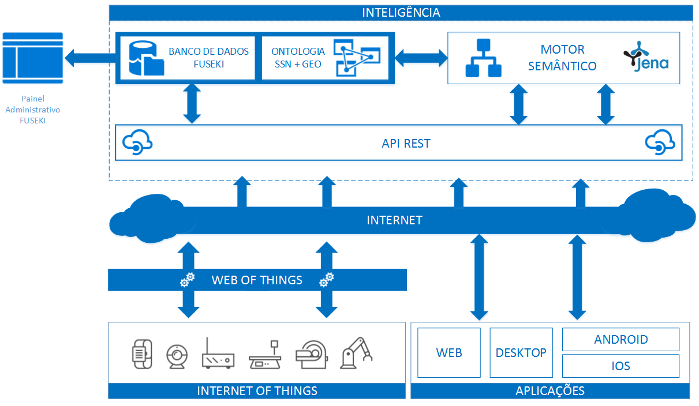

# IMPLEMENTAÇÃO DE UM MOTOR SEMÂNTICO PARA AMBIENTES IOT
Trabalho de conclusão de curso de Ciência da Computação

## RESUMO
Com a ascensão da Internet of Things muitos dados serão gerados por estes ambientes, porém estes dados não possuem nenhum nível semântico para que possam ser compreensíveis não somente por humanos, mas também por máquinas através de agentes inteligentes. Para a estruturação formal e semântica desses dados foram utilizadas técnicas do paradigma da Web Semântica e uma ontologia pré-definida para ambientes IoT. O desenvolvimento de sistemas semânticos exige um conhecimento apurado de suas tecnologias e ontologias, assim, foi implementando um motor
semântico que possui uma API para a manipulação dos dados na ontologia, as informações geradas pelos sensores podem ser enviadas utilizando a API do motor semântico, possibilitando a interoperabilidade entre diferentes tecnologias e a facilitando o uso para os desenvolvedores. Com a criação da API para a manipulação da ontologia é possível a criação de aplicações Web e até mesmo aplicativos para smartphones, abrindo um leque enorme de possibilidades de sistemas que utilizam semântica para ambientes IoT.

### Palavras-chave: Internet of Things, Web Semântica, API semântica, motor semântico, ontologia, sensores.

## ABSTRACT
With the rise of the Internet of Things many data will be generated by these environments, but these data have no semantic level so that they can be understood not only by humans, but also by machines through intelligent agents. For the formal and semantic structuring of these data, Semantic Web paradigm techniques and a predefined ontology for IoT environments were used. The development of semantic
systems requires a thorough knowledge of its technologies and ontologies, thus, it has been implementing a semantic engine that has an API for the manipulation of the data in the ontology, the information generated by the sensors can be sent using the semantic engine API, making possible interoperability between different technologies and making it easier for developers to use. With the creation of the API for the manipulation of the ontology it is possible to create Web applications and even applications for smartphones, opening a huge range of possibilities of systems that use semantics for IoT environments.

### Keywords: Internet of Things, Semantic Web, semantic API, semantic engine, ontology, sensors.

# ARQUITETURA MOTOR SEMÂNTICO

# TRABALHO .PDF
[IMPLEMENTAÇÃO DE UM MOTOR SEMÂNTICO PARA AMBIENTES IOT](Monografia.pdf)

